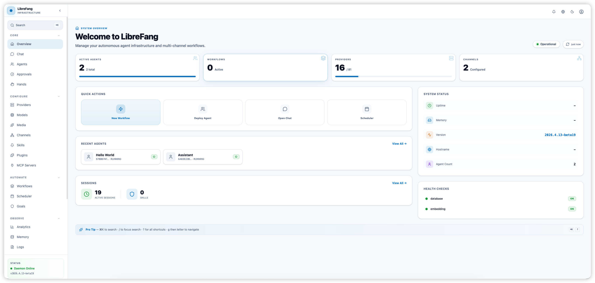
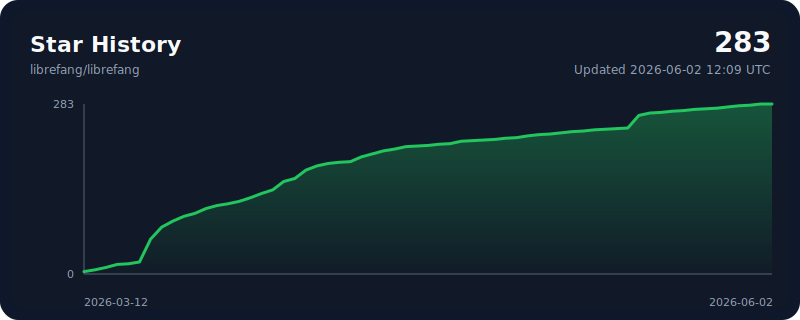

<p align="center">
  
</p>

<h1 align="center">BossFang</h1>
<h3 align="center">Libre Agent Operating System — Free as in Freedom</h3>

<p align="center">
  Open-source Agent OS built in Rust. 14 crates. 2,100+ tests. Zero clippy warnings.
</p>

<p align="center">
  <a href="README.md">English</a> | <a href="i18n/README.zh.md">中文</a> | <a href="i18n/README.ja.md">日本語</a> | <a href="i18n/README.ko.md">한국어</a> | <a href="i18n/README.es.md">Español</a> | <a href="i18n/README.de.md">Deutsch</a> | <a href="i18n/README.pl.md">Polski</a>
</p>

<p align="center">
  <a href="https://librefang.ai/">Website</a> &bull;
  <a href="https://docs.librefang.ai">Docs</a> &bull;
  <a href="CONTRIBUTING.md">Contributing</a> &bull;
  <a href="https://discord.gg/DzTYqAZZmc">Discord</a>
</p>

<p align="center">
  <a href="https://github.com/librefang/librefang/actions/workflows/ci.yml"></a>
  
  
  
  
  <a href="https://discord.gg/DzTYqAZZmc"></a>
  <a href="https://deepwiki.com/librefang/librefang"></a>
</p>

---

## What is LibreFang?

LibreFang is an **Agent Operating System** — a full platform for running autonomous AI agents, built from scratch in Rust. Not a chatbot framework, not a Python wrapper.

Traditional agent frameworks wait for you to type something. LibreFang runs **agents that work for you** — on schedules, 24/7, monitoring targets, generating leads, managing social media, and reporting to your dashboard.

> LibreFang is a community fork of [`RightNow-AI/openfang`](https://github.com/RightNow-AI/openfang) with open governance and a merge-first PR policy. See [GOVERNANCE.md](GOVERNANCE.md) for details.

<p align="center">
  
</p>

## Quick Start

```bash
# Install (Linux/macOS/WSL)
curl -fsSL https://librefang.ai/install.sh | sh

# Or install via Cargo
cargo install --git https://github.com/librefang/librefang librefang-cli

# Start — auto-initializes on first run, dashboard at http://localhost:4545
librefang start

# Or run the setup wizard manually for interactive provider selection
# librefang init
```

<details>
<summary><strong>Homebrew</strong></summary>

```bash
brew tap librefang/tap
brew install librefang              # CLI (stable)
brew install --cask librefang       # Desktop (stable)
# Beta/RC channels also available:
# brew install librefang-beta       # or librefang-rc
# brew install --cask librefang-rc  # or librefang-beta
```

</details>

<details>
<summary><strong>Docker</strong></summary>

```bash
docker run -p 4545:4545 ghcr.io/librefang/librefang
```

</details>

<details>
<summary><strong>Cloud Deploy</strong></summary>

[](https://deploy.librefang.ai) [](https://deploy.librefang.ai) [](https://render.com/deploy?repo=https://github.com/librefang/librefang) [](https://railway.app/template/librefang) [](deploy/gcp/README.md)

</details>

## Hands: Agents That Work for You

**Hands** are pre-built autonomous capability packages that run independently, on schedules, without prompting. 14 bundled:

| Hand | What It Does |
|------|-------------|
| **Researcher** | Deep research — multi-source, credibility scoring (CRAAP), cited reports |
| **Collector** | OSINT monitoring — change detection, sentiment tracking, knowledge graph |
| **Predictor** | Superforecasting — calibrated predictions with confidence intervals |
| **Strategist** | Strategy analysis — market research, competitive intel, business planning |
| **Analytics** | Data analytics — collection, analysis, visualization, automated reporting |
| **Trader** | Market intelligence — multi-signal analysis, risk management, portfolio analytics |
| **Lead** | Prospect discovery — web research, scoring, dedup, qualified lead delivery |
| **Twitter** | Autonomous X/Twitter — content creation, scheduling, approval queue |
| **Reddit** | Reddit manager — subreddit monitoring, posting, engagement tracking |
| **LinkedIn** | LinkedIn manager — content creation, networking, professional engagement |
| **Clip** | YouTube to vertical shorts — cuts best moments, captions, voice-over |
| **Browser** | Web automation — Playwright-based, mandatory purchase approval gate |
| **API Tester** | API testing — endpoint discovery, validation, load testing, regression detection |
| **DevOps** | DevOps automation — CI/CD, infrastructure monitoring, incident response |

```bash
librefang hand activate researcher   # Starts working immediately
librefang hand status researcher     # Check progress
librefang hand list                  # See all Hands
```

Build your own: define a `HAND.toml` + system prompt + `SKILL.md`. [Guide](https://docs.librefang.ai/agent/skills)

## Architecture

14 Rust crates, modular kernel design.

```
librefang-kernel      Orchestration, workflows, metering, RBAC, scheduler, budget
librefang-runtime     Agent loop, 3 LLM drivers, 53 tools, WASM sandbox, MCP, A2A
librefang-api         140+ REST/WS/SSE endpoints, OpenAI-compatible API, dashboard
librefang-channels    40 messaging adapters with rate limiting, DM/group policies
librefang-memory      11 storage backend traits + SurrealDB/SQLite impls, vector embeddings
librefang-storage     SurrealDB 3.0 connection pool, 10 DDL migrations, sqlite→surreal migrator
librefang-types       Core types, taint tracking, Ed25519 signing, model catalog
librefang-skills      60 bundled skills, SKILL.md parser, FangHub marketplace
librefang-hands       14 autonomous Hands, HAND.toml parser, lifecycle management
librefang-extensions  25 MCP templates, AES-256-GCM vault, OAuth2 PKCE
librefang-wire        OFP P2P protocol, HMAC-SHA256 mutual auth
librefang-cli         CLI, daemon management, TUI dashboard, MCP server mode
librefang-desktop     Tauri 2.0 native app (tray, notifications, shortcuts)
librefang-migrate     OpenClaw, LangChain, AutoGPT migration engine
xtask                 Build automation
```

---

## SurrealDB Storage Backend — 100% Feature Parity

LibreFang has completed a full migration to **SurrealDB 3.0** as its production storage backend. When `--features surreal-backend` is enabled, **every SQLite call path in the kernel, runtime, and API layers is replaced** — no SQLite code executes at all. SQLite remains available as a legacy fallback for operators who have not yet migrated.

> **Answer to "Is this a complete migration?"** — Yes. As of this release, the `surreal-backend` feature gate eliminates every rusqlite call path across all 14 crates. The architecture question has been resolved: the trait-per-concern pattern is now fully implemented for every subsystem, and the SQLite-to-SurrealDB data migration tool covers all tables.

### Architecture: Trait-per-Concern

Every storage subsystem is now abstracted behind its own trait object in the kernel, following the same pattern as `agent_store` and `audit_log`. Each trait has a SurrealDB implementation (default) and a SQLite fallback:

| Kernel Field | Trait | SurrealDB Impl | SQLite Fallback |
|---|---|---|---|
| `agent_store` | `MemoryBackend` | `SurrealMemoryBackend` | `MemorySubstrate` |
| `audit_log` | `AuditStore` | `SurrealAuditStore` | `AuditLog` |
| `trace_backend` | `TraceBackend` | `SurrealTraceBackend` | `TraceStore` |
| `session_store` | `SessionBackend` | `SurrealSessionBackend` | `MemorySubstrate` |
| `kv_store` | `KvBackend` | `SurrealKvBackend` | `MemorySubstrate` |
| `task_backend` | `TaskBackend` | `SurrealTaskBackend` | `MemorySubstrate` |
| `proactive_backend` | `ProactiveMemoryBackend` | `SurrealProactiveMemoryBackend` | `MemorySubstrate` |
| `knowledge_backend` | `KnowledgeBackend` | `SurrealKnowledgeBackend` | `MemorySubstrate` |
| `usage_store` | `UsageBackend` | `SurrealUsageStore` | `UsageStore` |
| `device_store` | `DeviceBackend` | `SurrealDeviceStore` | `MemorySubstrate` |
| `prompt_store` | `PromptBackend` | `SurrealPromptStore` | `PromptStore` |
| `totp_lockout` | `TotpLockoutBackend` | `SurrealTotpLockoutBackend` | SQLite path |

### SurrealDB DDL Migrations

Ten idempotent DDL migrations are applied at kernel boot (`OPERATIONAL_MIGRATIONS`, `v1`–`v10`):

| Migration | Tables Covered |
|---|---|
| `001_agents.surql` | `agents` |
| `002_audit_entries.surql` | `audit_entries` |
| `003_totp_lockout.surql` | `totp_lockout` |
| `004_hook_traces.surql` | `hook_traces`, `circuit_breaker_states` |
| `005_sessions.surql` | `sessions`, `canonical_sessions` |
| `006_kv_store.surql` | `kv_store` |
| `007_task_queue.surql` | `task_queue` |
| `008_usage_events.surql` | `usage_events` |
| `009_paired_devices.surql` | `paired_devices` |
| `010_prompt_management.surql` | `prompt_versions`, `prompt_experiments`, `experiment_variants`, `experiment_metrics` |

All migrations use `DEFINE TABLE IF NOT EXISTS` / `DEFINE FIELD IF NOT EXISTS` / `DEFINE INDEX IF NOT EXISTS` — safe to apply on every boot, and re-entrant.

### What was migrated in the final phase

The previous partial migration (phases 1–6) had wired agents, audit, TOTP lockout, and UAR provisioning to SurrealDB. The following subsystems **were still using SQLite** and are now fully migrated:

| Subsystem | Change |
|---|---|
| **Hook traces** (Phase 7) | `SurrealTraceBackend` wired into `ContextEngine`; `open_trace_store()` gated behind `#[cfg(not(feature = "surreal-backend"))]` |
| **Sessions & canonical sessions** (Phase 8) | `SurrealSessionBackend` replaces 11 `self.memory.*_session` call sites |
| **Structured KV store** (Phase 9) | `SurrealKvBackend` replaces 3 `self.memory.structured_get` call sites |
| **Task queue** (Phase 10) | `SurrealTaskBackend` replaces `task_reset_stuck` call site |
| **Proactive memory & knowledge graph** (Phase 11) | `SurrealProactiveMemoryBackend` and `SurrealKnowledgeBackend` via `surreal-memory` library; decay/consolidation/vacuum routed to SurrealDB |
| **LLM usage events** (Phase 12) | `SurrealUsageStore` implements full `UsageBackend` with quota/budget enforcement; `MeteringEngine` changed to `Arc<dyn UsageBackend>` |
| **Paired devices** (Phase 13) | `SurrealDeviceStore` with `device_id`-keyed upserts; `PairingManager` load/save/remove callbacks use SurrealDB |
| **Prompt versioning & A/B experiments** (Phase 14) | `SurrealPromptStore` implements full `PromptBackend`; `prompt_store` kernel field changed from `OnceLock<PromptStore>` to `Arc<dyn PromptBackend>` |
| **Migration tool** (Phase 15) | `sqlite_to_surreal.rs` extended with copiers for all 8 new tables |
| **Config & API cleanup** (Phase 16) | `sqlite_path`/`fts_only` gated in JSON responses; trace endpoint returns informative message when surreal-backend active |

### Migrating existing data from SQLite

The one-shot migration tool copies all historical data from an existing SQLite database into SurrealDB. Writes are idempotent — reruns converge without duplicating rows.

```bash
# Dry run — counts rows without writing
curl -X POST http://localhost:4545/api/storage/migrate \
  -H "Content-Type: application/json" \
  -d '{"sqlite_path": "/home/user/.librefang/librefang.db", "dry_run": true}'

# Live migration — writes to SurrealDB, emits a receipt JSON
curl -X POST http://localhost:4545/api/storage/migrate \
  -H "Content-Type: application/json" \
  -d '{"sqlite_path": "/home/user/.librefang/librefang.db", "dry_run": false}'
```

Tables migrated: `audit_entries`, `hook_traces`, `circuit_breaker_states`, `totp_lockout`, `agents`, `sessions`, `canonical_sessions`, `kv_store`, `task_queue`, `usage_events`, `paired_devices`, `prompt_versions`, `prompt_experiments`.

### Why SurrealDB

| Property | SQLite (legacy) | SurrealDB 3.0 (default) |
|---|---|---|
| Deployment | Single-process only | Embedded or remote cluster |
| Scale | Dev / single-node | Multi-node, horizontally scalable |
| Query model | SQL | SurrealQL — relational, graph, document |
| Schema migration | Manual SQL scripts | Idempotent DDL, safe to re-apply |
| Shared state | Not possible | Multiple daemon processes share one DB |
| UAR integration | Not supported | Namespaced scoped-user provisioning |
| Secrets at rest | N/A | Credentials read from env vars only |
| Proactive memory | `surreal-memory` adapter | Native SurrealDB graph queries |

### Choosing a backend

The backend is selected at **compile time** via the `surreal-backend` Cargo feature (the default). When the feature is off, the kernel runs entirely on SQLite with zero new dependencies.

```toml
# ~/.librefang/config.toml

# --- Embedded SurrealDB (default, no external process needed) ---
[storage]
namespace = "librefang"
database  = "main"

[storage.backend]
kind = "embedded"
path = "/home/user/.librefang/librefang.surreal"

# --- Remote SurrealDB cluster ---
[storage]
namespace = "librefang"
database  = "main"

[storage.backend]
kind            = "remote"
url             = "wss://surreal.example.com"
username        = "lf_app"
password_env    = "LF_DB_PASS"   # env var name — password never stored in config
tls_skip_verify = false          # true emits a warning; never use in production
```

### Linking a Universal Agent Runtime (UAR) instance

`POST /api/storage/link-uar` performs one-shot DDL provisioning when admin credentials are supplied:

1. Reads `root_password_env` and `app_password_env` from the environment.
2. Opens a **temporary** root-level SurrealDB connection.
3. Idempotently executes `DEFINE NAMESPACE / DATABASE / USER` DDL.
4. Drops the root connection immediately — credentials are never cached.
5. Writes the application-level remote config to `config.toml`.

```bash
export SURREAL_ROOT_PASS="my-root-secret"
export SURREAL_UAR_PASS="my-app-secret"

curl -X POST http://localhost:4545/api/storage/link-uar \
  -H "Content-Type: application/json" \
  -d '{
    "remote_url":         "wss://surreal.example.com",
    "namespace":          "uar",
    "app_user":           "uar_app",
    "app_pass_ref":       "SURREAL_UAR_PASS",
    "also_link_memory":   true,
    "admin_username":     "root",
    "admin_password_env": "SURREAL_ROOT_PASS"
  }'
```

### Building

```bash
# Default build — SurrealDB backend active
cargo build --workspace --features surreal-backend

# SQLite-only fallback build
cargo build --workspace

# Verify full workspace with surreal-backend (zero errors, zero warnings)
cargo check --workspace --features surreal-backend
cargo test  --workspace
```

---

## Key Features

**40 Channel Adapters** — Telegram, Discord, Slack, WhatsApp, Signal, Matrix, Email, Teams, Google Chat, Feishu, LINE, Mastodon, Bluesky, and 26 more. [Full list](https://docs.librefang.ai/integrations/channels)

**28 LLM Providers** — Anthropic, Gemini, OpenAI, Groq, DeepSeek, OpenRouter, Ollama, Alibaba Coding Plan, and 20 more. Intelligent routing, automatic fallback, cost tracking. [Details](https://docs.librefang.ai/configuration/providers)

**16 Security Layers** — WASM sandbox, Merkle audit trail, taint tracking, Ed25519 signing, SSRF protection, secret zeroization, and more. [Details](https://docs.librefang.ai/getting-started/comparison#16-security-systems--defense-in-depth)

**OpenAI-Compatible API** — Drop-in `/v1/chat/completions` endpoint. 140+ REST/WS/SSE endpoints. [API Reference](https://docs.librefang.ai/integrations/api)

**Client SDKs** — Full REST client with streaming support.

```javascript
// JavaScript/TypeScript
npm install @librefang/sdk
const { LibreFang } = require("@librefang/sdk");
const client = new LibreFang("http://localhost:4545");
const agent = await client.agents.create({ template: "assistant" });
const reply = await client.agents.message(agent.id, "Hello!");
```

```python
# Python
pip install librefang
from librefang import Client
client = Client("http://localhost:4545")
agent = client.agents.create(template="assistant")
reply = client.agents.message(agent["id"], "Hello!")
```

```rust
// Rust
cargo add librefang
use librefang::LibreFang;
let client = LibreFang::new("http://localhost:4545");
let agent = client.agents().create(CreateAgentRequest { template: Some("assistant".into()), .. }).await?;
```

```go
// Go
go get github.com/librefang/librefang/sdk/go
import "github.com/librefang/librefang/sdk/go"
client := librefang.New("http://localhost:4545")
agent, _ := client.Agents.Create(map[string]interface{}{"template": "assistant"})
```

**MCP Support** — Built-in MCP client and server. Connect to IDEs, extend with custom tools, compose agent pipelines. [Details](https://docs.librefang.ai/integrations/mcp-a2a)

**A2A Protocol** — Google Agent-to-Agent protocol support. Discover, communicate, and delegate tasks across agent systems. [Details](https://docs.librefang.ai/integrations/mcp-a2a)

**Desktop App** — Tauri 2.0 native app with system tray, notifications, and global shortcuts.

**OpenClaw Migration** — `librefang migrate --from openclaw` imports agents, history, skills, and config.

## Development

```bash
cargo build --workspace --lib                            # Build
cargo test --workspace                                   # 2,100+ tests
cargo clippy --workspace --all-targets -- -D warnings    # Zero warnings
cargo fmt --all -- --check                               # Format check

# Build with SurrealDB backend enabled
cargo build --workspace --features surreal-backend
cargo test  --workspace --features surreal-backend
```

## Comparison

See [Comparison](https://docs.librefang.ai/getting-started/comparison#16-security-systems--defense-in-depth) for benchmarks and feature-by-feature comparison vs OpenClaw, ZeroClaw, CrewAI, AutoGen, and LangGraph.

## Links

- [Documentation](https://docs.librefang.ai) &bull; [API Reference](https://docs.librefang.ai/integrations/api) &bull; [Getting Started](https://docs.librefang.ai/getting-started) &bull; [Troubleshooting](https://docs.librefang.ai/operations/troubleshooting)
- [Contributing](CONTRIBUTING.md) &bull; [Governance](GOVERNANCE.md) &bull; [Security](SECURITY.md)
- Discussions: [Q&A](https://github.com/librefang/librefang/discussions/categories/q-a) &bull; [Use Cases](https://github.com/librefang/librefang/discussions/categories/show-and-tell) &bull; [Feature Votes](https://github.com/librefang/librefang/discussions/categories/ideas) &bull; [Announcements](https://github.com/librefang/librefang/discussions/categories/announcements) &bull; [Discord](https://discord.gg/DzTYqAZZmc)

## Contributors

<a href="https://github.com/librefang/librefang/graphs/contributors">
  
</a>

<p align="center">
  We welcome contributions of all kinds — code, docs, translations, bug reports.<br/>
  Check the <a href="CONTRIBUTING.md">Contributing Guide</a> and pick a <a href="https://github.com/librefang/librefang/issues?q=is%3Aissue+is%3Aopen+label%3A%22good+first+issue%22">good first issue</a> to get started!<br/>
  You can also visit the <a href="https://leszek3737.github.io/librefang-WIki/">unofficial wiki</a>, which is updated with helpful information for new contributors.
</p>

<p align="center">
  <a href="https://github.com/librefang/librefang/stargazers">
    
  </a>
</p>

---

<p align="center">MIT License</p>
