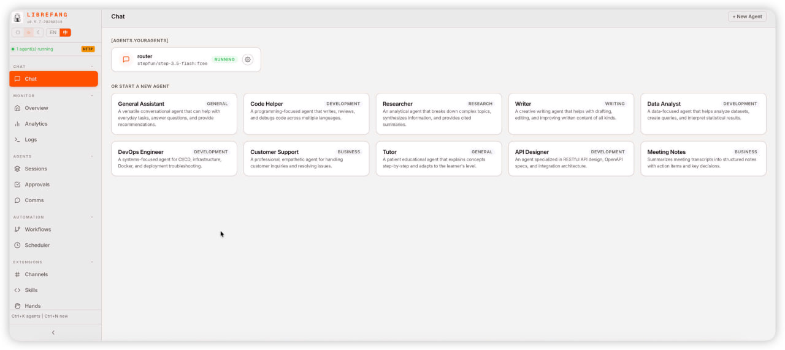

<p align="center">
  
</p>

<h1 align="center">LibreFang</h1>
<h3 align="center">Libre Agent Operating System — Free as in Freedom</h3>

<p align="center">
  Open-source Agent OS built in Rust. 14 crates. 2,100+ tests. Zero clippy warnings.
</p>

<p align="center">
  <a href="README.md">English</a> | <a href="i18n/README.zh.md">中文</a> | <a href="i18n/README.ja.md">日本語</a> | <a href="i18n/README.ko.md">한국어</a> | <a href="i18n/README.es.md">Español</a> | <a href="i18n/README.de.md">Deutsch</a>
</p>

<p align="center">
  <a href="https://librefang.ai/">Website</a> &bull;
  <a href="https://docs.librefang.ai">Docs</a> &bull;
  <a href="docs/CONTRIBUTING.md">Contributing</a> &bull;
  <a href="https://discord.gg/DzTYqAZZmc">Discord</a>
</p>

<p align="center">
  <a href="https://github.com/librefang/librefang/actions/workflows/ci.yml"></a>
  
  
  
  
  <a href="https://discord.gg/DzTYqAZZmc"></a>
</p>

---

## What is LibreFang?

LibreFang is an **Agent Operating System** — a full platform for running autonomous AI agents, built from scratch in Rust. Not a chatbot framework, not a Python wrapper.

Traditional agent frameworks wait for you to type something. LibreFang runs **agents that work for you** — on schedules, 24/7, monitoring targets, generating leads, managing social media, and reporting to your dashboard.

> LibreFang is a community fork of [`RightNow-AI/openfang`](https://github.com/RightNow-AI/openfang) with open governance and a merge-first PR policy. See [GOVERNANCE.md](docs/GOVERNANCE.md) for details.

<p align="center">
  
</p>

## Quick Start

```bash
# Install (Linux/macOS/WSL)
curl -fsSL https://librefang.ai/install.sh | sh

# Or install via Cargo
cargo install --git https://github.com/librefang/librefang librefang-cli

# Initialize (walks you through provider setup)
librefang init

# Start — dashboard live at http://localhost:4545
librefang start
```

<details>
<summary><strong>Homebrew</strong></summary>

```bash
brew tap librefang/tap && brew install librefang
```

</details>

<details>
<summary><strong>Docker</strong></summary>

```bash
docker run -p 4545:4545 ghcr.io/librefang/librefang
```

</details>

<details>
<summary><strong>Cloud Deploy</strong></summary>

[](https://deploy.librefang.ai) [](https://deploy.librefang.ai) [](https://render.com/deploy?repo=https://github.com/librefang/librefang) [](https://railway.app/template/librefang) [](deploy/gcp/README.md)

</details>

## Hands: Agents That Work for You

**Hands** are pre-built autonomous capability packages that run independently, on schedules, without prompting. 14 bundled:

| Hand | What It Does |
|------|-------------|
| **Researcher** | Deep research — multi-source, credibility scoring (CRAAP), cited reports |
| **Collector** | OSINT monitoring — change detection, sentiment tracking, knowledge graph |
| **Predictor** | Superforecasting — calibrated predictions with confidence intervals |
| **Strategist** | Strategy analysis — market research, competitive intel, business planning |
| **Analytics** | Data analytics — collection, analysis, visualization, automated reporting |
| **Trader** | Market intelligence — multi-signal analysis, risk management, portfolio analytics |
| **Lead** | Prospect discovery — web research, scoring, dedup, qualified lead delivery |
| **Twitter** | Autonomous X/Twitter — content creation, scheduling, approval queue |
| **Reddit** | Reddit manager — subreddit monitoring, posting, engagement tracking |
| **LinkedIn** | LinkedIn manager — content creation, networking, professional engagement |
| **Clip** | YouTube to vertical shorts — cuts best moments, captions, voice-over |
| **Browser** | Web automation — Playwright-based, mandatory purchase approval gate |
| **API Tester** | API testing — endpoint discovery, validation, load testing, regression detection |
| **DevOps** | DevOps automation — CI/CD, infrastructure monitoring, incident response |

```bash
librefang hand activate researcher   # Starts working immediately
librefang hand status researcher     # Check progress
librefang hand list                  # See all Hands
```

Build your own: define a `HAND.toml` + system prompt + `SKILL.md`. [Guide](docs/skill-development.md)

## Architecture

14 Rust crates, modular kernel design.

```
librefang-kernel      Orchestration, workflows, metering, RBAC, scheduler, budget
librefang-runtime     Agent loop, 3 LLM drivers, 53 tools, WASM sandbox, MCP, A2A
librefang-api         140+ REST/WS/SSE endpoints, OpenAI-compatible API, dashboard
librefang-channels    40 messaging adapters with rate limiting, DM/group policies
librefang-memory      SQLite persistence, vector embeddings, sessions, compaction
librefang-types       Core types, taint tracking, Ed25519 signing, model catalog
librefang-skills      60 bundled skills, SKILL.md parser, FangHub marketplace
librefang-hands       14 autonomous Hands, HAND.toml parser, lifecycle management
librefang-extensions  25 MCP templates, AES-256-GCM vault, OAuth2 PKCE
librefang-wire        OFP P2P protocol, HMAC-SHA256 mutual auth
librefang-cli         CLI, daemon management, TUI dashboard, MCP server mode
librefang-desktop     Tauri 2.0 native app (tray, notifications, shortcuts)
librefang-migrate     OpenClaw, LangChain, AutoGPT migration engine
xtask                 Build automation
```

## Key Features

**40 Channel Adapters** — Telegram, Discord, Slack, WhatsApp, Signal, Matrix, Email, Teams, Google Chat, Feishu, LINE, Mastodon, Bluesky, and 26 more. [Full list](docs/channel-adapters.md)

**27 LLM Providers** — Anthropic, Gemini, OpenAI, Groq, DeepSeek, OpenRouter, Ollama, and 20 more. Intelligent routing, automatic fallback, cost tracking. [Details](docs/providers.md)

**16 Security Layers** — WASM sandbox, Merkle audit trail, taint tracking, Ed25519 signing, SSRF protection, secret zeroization, and more. [Details](docs/comparison.md#16-security-systems--defense-in-depth)

**OpenAI-Compatible API** — Drop-in `/v1/chat/completions` endpoint. 140+ REST/WS/SSE endpoints. [API Reference](docs/api-reference.md)

**Client SDKs** — [JavaScript](sdk/javascript) &bull; [Python](sdk/python) &bull; [Rust](sdk/rust) &bull; [Go](sdk/go) — full REST client with streaming support.

**MCP Support** — Built-in MCP client and server. Connect to IDEs, extend with custom tools, compose agent pipelines. [Details](docs/providers.md)

**A2A Protocol** — Google Agent-to-Agent protocol support. Discover, communicate, and delegate tasks across agent systems. [Details](docs/api-reference.md)

**Desktop App** — Tauri 2.0 native app with system tray, notifications, and global shortcuts.

**OpenClaw Migration** — `librefang migrate --from openclaw` imports agents, history, skills, and config.

## Development

```bash
cargo build --workspace --lib                            # Build
cargo test --workspace                                   # 2,100+ tests
cargo clippy --workspace --all-targets -- -D warnings    # Zero warnings
cargo fmt --all -- --check                               # Format check
```

## Comparison

See [docs/comparison.md](docs/comparison.md) for benchmarks and feature-by-feature comparison vs OpenClaw, ZeroClaw, CrewAI, AutoGen, and LangGraph.

## Links

- [Documentation](https://docs.librefang.ai) &bull; [API Reference](docs/api-reference.md) &bull; [Getting Started](docs/getting-started.md) &bull; [Troubleshooting](docs/troubleshooting.md)
- [Contributing](docs/CONTRIBUTING.md) &bull; [Governance](docs/GOVERNANCE.md) &bull; [Security](docs/SECURITY.md)
- Discussions: [Q&A](https://github.com/librefang/librefang/discussions/categories/q-a) &bull; [Use Cases](https://github.com/librefang/librefang/discussions/categories/show-and-tell) &bull; [Feature Votes](https://github.com/librefang/librefang/discussions/categories/ideas) &bull; [Announcements](https://github.com/librefang/librefang/discussions/categories/announcements) &bull; [Discord](https://discord.gg/DzTYqAZZmc)

## Contributors

<a href="https://github.com/librefang/librefang/graphs/contributors">
  
</a>

<p align="center">
  We welcome contributions of all kinds — code, docs, translations, bug reports.<br/>
  Check the <a href="docs/CONTRIBUTING.md">Contributing Guide</a> and pick a <a href="https://github.com/librefang/librefang/issues?q=is%3Aissue+is%3Aopen+label%3A%22good+first+issue%22">good first issue</a> to get started!
</p>

<p align="center">
  <a href="https://github.com/librefang/librefang/stargazers">
    
  </a>
</p>

---

<p align="center">MIT License</p>
