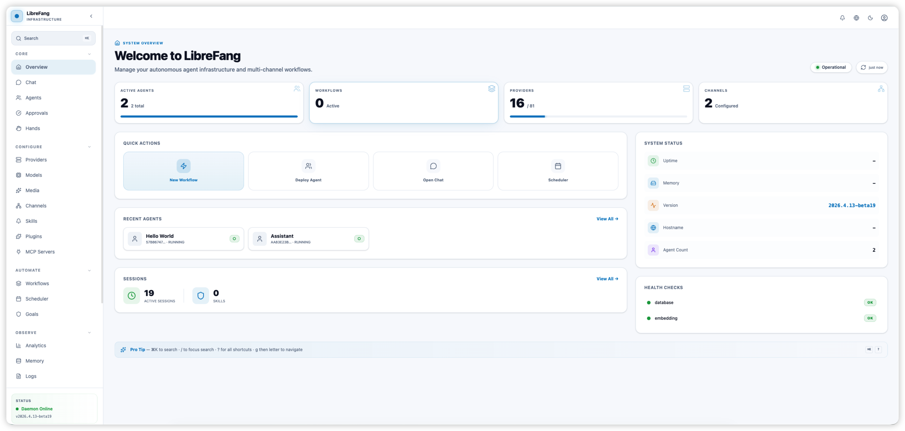
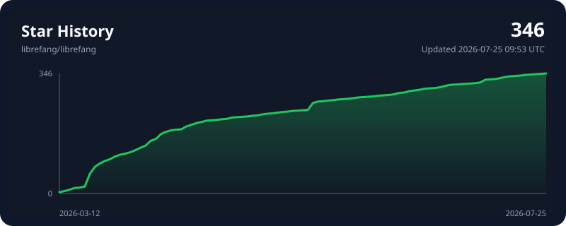

<p align="center">
  
</p>

<h1 align="center">LibreFang</h1>
<h3 align="center">Libre Agent Operating System — Free as in Freedom</h3>

<p align="center">
  Open-source Agent OS built in Rust. 24 crates. 2,100+ tests. Zero clippy warnings.
</p>

<p align="center">
  <strong>Official integration partner:</strong>
  <a href="https://everyapi.ai/integrations/librefang?utm_source=librefang_github&amp;utm_medium=partner&amp;utm_campaign=librefang_everyapi">LibreFang × EveryAPI</a>
  — Agent OS + unified AI infrastructure.
</p>

<p align="center">
  <a href="README.md">English</a> | <a href="i18n/README.zh.md">中文</a> | <a href="i18n/README.ja.md">日本語</a> | <a href="i18n/README.ko.md">한국어</a> | <a href="i18n/README.es.md">Español</a> | <a href="i18n/README.de.md">Deutsch</a> | <a href="i18n/README.pl.md">Polski</a> | <a href="i18n/README.fr.md">Français</a> | <a href="i18n/README.uk.md">Українська</a>
</p>

<p align="center">
  <a href="https://librefang.ai/">Website</a> &bull;
  <a href="https://docs.librefang.ai">Docs</a> &bull;
  <a href="CONTRIBUTING.md">Contributing</a> &bull;
  <a href="https://discord.gg/DzTYqAZZmc">Discord</a>
</p>

<p align="center">
  <a href="https://github.com/librefang/librefang/actions/workflows/ci.yml"></a>
  
  
  
  
  <a href="https://discord.gg/DzTYqAZZmc"></a>
  <a href="https://deepwiki.com/librefang/librefang"></a>
</p>

---

## What is LibreFang?

LibreFang is an **Agent Operating System** — a full platform for running autonomous AI agents, built from scratch in Rust. Not a chatbot framework, not a Python wrapper.

Traditional agent frameworks wait for you to type something. LibreFang runs **agents that work for you** — on schedules, 24/7, monitoring targets, generating leads, managing social media, and reporting to your dashboard.

> LibreFang is a community fork of [`RightNow-AI/openfang`](https://github.com/RightNow-AI/openfang) with open governance and a merge-first PR policy. See [GOVERNANCE.md](GOVERNANCE.md) for details.

<p align="center">
  
</p>

## Quick Start

```bash
# Install (Linux/macOS/WSL)
curl -fsSL https://librefang.ai/install.sh | sh

# Or install via Cargo
cargo install --git https://github.com/librefang/librefang librefang-cli

# Start — auto-initializes on first run, dashboard at http://localhost:4545
librefang start

# Or run the setup wizard manually for interactive provider selection
# librefang init
```

<details open>
<summary><strong>Homebrew</strong></summary>

> 🎉 **LibreFang is now in [homebrew-core](https://github.com/Homebrew/homebrew-core/pull/290413)!**
> Accepted into the official Homebrew tap on 2026-07-08 — install the CLI with zero setup, no tap required.

```bash
brew install librefang              # CLI (stable) — official homebrew-core
```

The desktop app and pre-release channels are published through the LibreFang tap:

```bash
brew tap librefang/tap
brew install --cask librefang       # Desktop (stable)
# Beta/RC channels:
# brew install librefang-beta       # or librefang-rc
# brew install --cask librefang-rc  # or librefang-beta
```

</details>

<details open>
<summary><strong>Arch Linux (pacman)</strong></summary>

> AUR account registration is temporarily unavailable, so LibreFang currently publishes signed packages through its official pacman repository.

```bash
# Import and locally trust the LibreFang package-signing key
curl -fsSL https://packages.librefang.ai/librefang.gpg -o /tmp/librefang.gpg
sudo pacman-key --add /tmp/librefang.gpg
sudo pacman-key --finger 2C325B0F88706ED99C45E216DD09DC7D3E70E1E9
sudo pacman-key --lsign-key 2C325B0F88706ED99C45E216DD09DC7D3E70E1E9
```

Add the repository to `/etc/pacman.conf`:

```ini
[librefang]
Server = https://packages.librefang.ai/arch/$arch
```

`librefang-bin` and `librefang-desktop-bin` are independent packages.
Install only the package for the interface you need.

#### CLI, daemon, and web dashboard

```bash
sudo pacman -Syu librefang-bin
```

#### Desktop app (x86_64 only)

```bash
sudo pacman -Syu librefang-desktop-bin
```

See the [Arch repository documentation](packaging/arch-repo/README.md) for package details and aarch64 support.

</details>

<details open>
<summary><strong>NixOS (Nix flakes)</strong></summary>

```bash
# Run the CLI once without installing anything
nix run github:librefang/librefang

# Install the CLI into your user profile
nix profile install github:librefang/librefang#librefang-cli
```

`librefang-cli` is a deliberately scoped package: it builds `--package librefang-cli` only, so the Tauri / GTK webview stack that just `librefang-desktop` links against never enters the CLI build.
The `cliArgs` comment in [`flake.nix`](flake.nix) records why that split exists — without it, `nix build .#librefang-cli` fails on a stock NixOS machine that has no graphics stack installed.

#### CLI, daemon, and web dashboard (declarative)

Add the flake as an input to your system flake and import the NixOS module:

```nix
{
  inputs = {
    nixpkgs.url = "github:NixOS/nixpkgs/nixos-unstable";
    librefang.url = "github:librefang/librefang";
  };

  outputs = { nixpkgs, librefang, ... }: {
    nixosConfigurations.myhost = nixpkgs.lib.nixosSystem {
      system = "x86_64-linux";
      modules = [
        librefang.nixosModules.default
        ./configuration.nix
      ];
    };
  };
}
```

Then enable the service from `configuration.nix`:

```nix
{
  services.librefang.enable = true;
}
```

#### Desktop app

```bash
nix profile install github:librefang/librefang#librefang-desktop
```

The desktop app is the rougher path on NixOS.
It links the full GTK / webview closure (`gtk3`, `libsoup_3`, `webkitgtk_4_1`, plus a runtime `dlopen` of `libayatana-appindicator3`), so it takes far longer to build than the CLI and it exercises code paths that the CLI package never touches.
If it does not build or launch on your machine, install `librefang-cli` instead and use the web dashboard at `http://127.0.0.1:4545/`.

Every `services.librefang` option, the `environmentFile` pattern for provider keys, and the known sharp edges are documented in [`docs/operations/nixos.md`](docs/operations/nixos.md).

</details>

<details open>
<summary><strong>Debian / Ubuntu / deepin</strong></summary>

> LibreFang does not publish an apt repository — `packaging/` ships an Arch repository and AUR recipes only.
> Install the CLI with the script below and take the desktop app from [Releases](https://github.com/librefang/librefang/releases).

#### CLI, daemon, and web dashboard

```bash
curl -fsSL https://librefang.ai/install.sh | sh
```

The Linux CLI is released as a fully static musl build for both `x86_64-unknown-linux-musl` and `aarch64-unknown-linux-musl`, and release CI hard-fails the job if `file` does not report the produced binary as statically linked.
The install script prefers that static artifact and only falls back to the glibc build when the static one is missing for your architecture.
That is what makes the host's glibc age irrelevant on an older distribution: a release whose glibc predates the one a distro-generic build was compiled against would reject that binary outright, while the static build links no libc from the host at all.
Check your own with `ldd --version` if you need the glibc build for an architecture the static one does not cover.

#### Desktop app

The `.deb` bundle declares an empty dependency list (`bundle.linux.deb.depends` in [`crates/librefang-desktop/tauri.conf.json`](crates/librefang-desktop/tauri.conf.json)), so `apt` will not pull the webview stack in for you.
Install it yourself first — this is the same dependency set the project installs on its own Debian-family runners:

```bash
sudo apt-get install -y \
  libwebkit2gtk-4.1-dev \
  libgtk-3-dev \
  libayatana-appindicator3-dev \
  librsvg2-dev \
  libdbus-1-dev
```

Whether deepin's own repositories carry `libwebkit2gtk-4.1` rather than the older `4.0` series is **not verified by this project**, so treat the command above as the thing to check rather than a guarantee.
Ask the machine you are installing on:

```bash
apt-cache search libwebkit2gtk        # lists whatever webkit2gtk packages your release actually carries
pkg-config --list-all | grep -i webkit
librefang doctor                      # environment audit for the local machine
```

If your release carries only the `4.0` series, the dependency above cannot be satisfied.
Install the CLI and use the web dashboard at `http://127.0.0.1:4545/` in that case.

</details>

<details open>
<summary><strong>Docker</strong></summary>

```bash
docker run -p 4545:4545 ghcr.io/librefang/librefang
```

</details>

<details open>
<summary><strong>Cloud Deploy</strong></summary>

[](https://deploy.librefang.ai) [](https://deploy.librefang.ai) [](https://render.com/deploy?repo=https://github.com/librefang/librefang) [](https://railway.app/template/librefang) [](deploy/gcp/README.md)

</details>

## Hands: Agents That Work for You

**Hands** are autonomous capability packages that run independently, on schedules, without prompting. Each Hand is defined by a `HAND.toml` manifest, a system prompt, and optional `SKILL.md` files loaded from your configured `hands_dir`.

Example Hand definitions (Researcher, Collector, Predictor, Strategist, Analytics, Trader, Lead, Twitter, Reddit, LinkedIn, Clip, Browser, API Tester, DevOps) are available in the [community hands repository](https://github.com/librefang-registry/hands).

```bash
# Install a community Hand, then:
librefang hand activate researcher   # Starts working immediately
librefang hand status researcher     # Check progress
librefang hand list                  # See all installed Hands
```

Build your own: define a `HAND.toml` + system prompt + `SKILL.md`. [Guide](https://docs.librefang.ai/agent/skills)

## Architecture

24 Rust crates + xtask, modular kernel design.

```
librefang-kernel            Orchestration, workflows, metering, RBAC, scheduler, budget
librefang-runtime           Agent loop, tool execution, WASM sandbox, MCP, A2A
librefang-api               140+ REST/WS/SSE endpoints, OpenAI-compatible API, dashboard
librefang-channels          45 messaging adapters with rate limiting, DM/group policies
librefang-memory            SQLite persistence, vector embeddings, sessions, compaction
librefang-types             Core types, taint tracking, Ed25519 signing, model catalog
librefang-skills            60 bundled skills, SKILL.md parser, FangHub marketplace
librefang-hands             HAND.toml parser, Hand registry, lifecycle management
librefang-extensions        25 MCP templates, AES-256-GCM vault, OAuth2 PKCE
librefang-wire              OFP P2P protocol, HMAC-SHA256 mutual auth (see note)
librefang-cli               CLI, daemon management, TUI dashboard, MCP server mode
librefang-desktop           Tauri 2.0 native app (tray, notifications, shortcuts)
librefang-import            OpenClaw, LangChain, AutoGPT import/migration engine
librefang-http              Shared HTTP client builder, proxy, TLS fallback
librefang-testing           Test infrastructure: mock kernel, mock LLM driver and API route test utilities
librefang-telemetry         OpenTelemetry + Prometheus metrics instrumentation for LibreFang
librefang-llm-driver        LLM driver trait and shared types for LibreFang
librefang-llm-drivers       Concrete LLM provider drivers (anthropic, openai, gemini, …) implementing librefang-llm-driver trait
librefang-runtime-mcp       MCP (Model Context Protocol) client for LibreFang runtime
librefang-kernel-handle     KernelHandle trait for in-process callers into the LibreFang kernel
librefang-kernel-router     Hand/Template routing engine for the LibreFang kernel
librefang-kernel-metering   Cost metering, quota enforcement for the LibreFang kernel
xtask                       Build automation
```

> **OFP wire is plaintext-by-design.** HMAC-SHA256 mutual auth + per-message
> HMAC + nonce replay protection cover *active* attackers, but frame contents
> are not encrypted. For cross-network federation, run OFP behind a private
> overlay (WireGuard, Tailscale, SSH tunnel) or a service-mesh mTLS layer.
> Details: [docs.librefang.ai/architecture/ofp-wire](https://docs.librefang.ai/architecture/ofp-wire)

## Key Features

**45 Channel Adapters** — Telegram, Discord, Slack, WhatsApp, Signal, Matrix, Email, Teams, Google Chat, Feishu, LINE, Mastodon, Bluesky, and 32 more. [Full list](https://docs.librefang.ai/integrations/channels)

**28 LLM Providers** — Anthropic, Gemini, OpenAI, Groq, DeepSeek, OpenRouter, Ollama, Alibaba Coding Plan, and 20 more. Intelligent routing, automatic fallback, cost tracking. [Details](https://docs.librefang.ai/configuration/providers)

**16 Security Layers** — WASM sandbox, Merkle audit trail, taint tracking, Ed25519 signing, SSRF protection, secret zeroization, and more. [Details](https://docs.librefang.ai/getting-started/comparison#16-security-systems--defense-in-depth)

**OpenAI-Compatible API** — Drop-in `/v1/chat/completions` endpoint. 140+ REST/WS/SSE endpoints. [API Reference](https://docs.librefang.ai/integrations/api)

**Client SDKs** — Full REST client with streaming support.

```javascript
// JavaScript/TypeScript
npm install @librefang/sdk
const { LibreFang } = require("@librefang/sdk");
const client = new LibreFang("http://localhost:4545");
const agent = await client.agents.create({ template: "assistant" });
const reply = await client.agents.message(agent.id, "Hello!");
```

```python
# Python
pip install librefang
from librefang import Client
client = Client("http://localhost:4545")
agent = client.agents.create(template="assistant")
reply = client.agents.message(agent["id"], "Hello!")
```

```rust
// Rust
cargo add librefang
use librefang::LibreFang;
let client = LibreFang::new("http://localhost:4545");
let agent = client.agents().create(CreateAgentRequest { template: Some("assistant".into()), .. }).await?;
```

```go
// Go
go get github.com/librefang/librefang/sdk/go
import "github.com/librefang/librefang/sdk/go"
client := librefang.New("http://localhost:4545")
agent, _ := client.Agents.Create(map[string]interface{}{"template": "assistant"})
```

**MCP Support** — Built-in MCP client and server. Connect to IDEs, extend with custom tools, compose agent pipelines. [Details](https://docs.librefang.ai/integrations/mcp-a2a)

**A2A Protocol** — Google Agent-to-Agent protocol support. Discover, communicate, and delegate tasks across agent systems. [Details](https://docs.librefang.ai/integrations/mcp-a2a)

**Desktop App** — Tauri 2.0 native app with system tray, notifications, and global shortcuts.

**OpenClaw Migration** — `librefang migrate --from openclaw` imports agents, history, skills, and config.

## Development

```bash
cargo build --workspace --lib                            # Build
cargo test --workspace                                   # 2,100+ tests
cargo clippy --workspace --all-targets -- -D warnings    # Zero warnings
cargo fmt --all -- --check                               # Format check
```

### Committing changes

Use `scripts/commit.sh` instead of `git commit` directly so staged Rust
files are rustfmt-clean before the pre-commit hook gates them:

```bash
scripts/commit.sh -m "feat: add foo"
scripts/commit.sh -F .git/COMMIT_EDITMSG
```

The wrapper runs `cargo fmt` on staged `*.rs` files, re-stages them, and
holds a soft lock against parallel commits in the same worktree. All flags
are forwarded to `git commit` unchanged. If `cargo` is unavailable the
script skips formatting and warns; the pre-commit hook still gates the
commit.

## Comparison

See [Comparison](https://docs.librefang.ai/getting-started/comparison#16-security-systems--defense-in-depth) for benchmarks and feature-by-feature comparison vs OpenClaw, ZeroClaw, CrewAI, AutoGen, and LangGraph.

## Links

- [Documentation](https://docs.librefang.ai) &bull; [API Reference](https://docs.librefang.ai/integrations/api) &bull; [Getting Started](https://docs.librefang.ai/getting-started) &bull; [Troubleshooting](https://docs.librefang.ai/operations/troubleshooting)
- [Contributing](CONTRIBUTING.md) &bull; [Governance](GOVERNANCE.md) &bull; [Security](SECURITY.md)
- Discussions: [Q&A](https://github.com/librefang/librefang/discussions/categories/q-a) &bull; [Use Cases](https://github.com/librefang/librefang/discussions/categories/show-and-tell) &bull; [Feature Votes](https://github.com/librefang/librefang/discussions/categories/ideas) &bull; [Announcements](https://github.com/librefang/librefang/discussions/categories/announcements) &bull; [Discord](https://discord.gg/DzTYqAZZmc)

## Contributors

<a href="https://github.com/librefang/librefang/graphs/contributors">
  
</a>

<p align="center">
  We welcome contributions of all kinds — code, docs, translations, bug reports.<br/>
  Check the <a href="CONTRIBUTING.md">Contributing Guide</a> and pick a <a href="https://github.com/librefang/librefang/issues?q=is%3Aissue+is%3Aopen+label%3A%22good+first+issue%22">good first issue</a> to get started!<br/>
  You can also visit the <a href="https://leszek3737.github.io/librefang-WIki/">unofficial wiki</a>, which is updated with helpful information for new contributors.
</p>

<p align="center">
  <a href="https://github.com/librefang/librefang/stargazers">
    
  </a>
</p>

---

<p align="center">MIT License</p>
