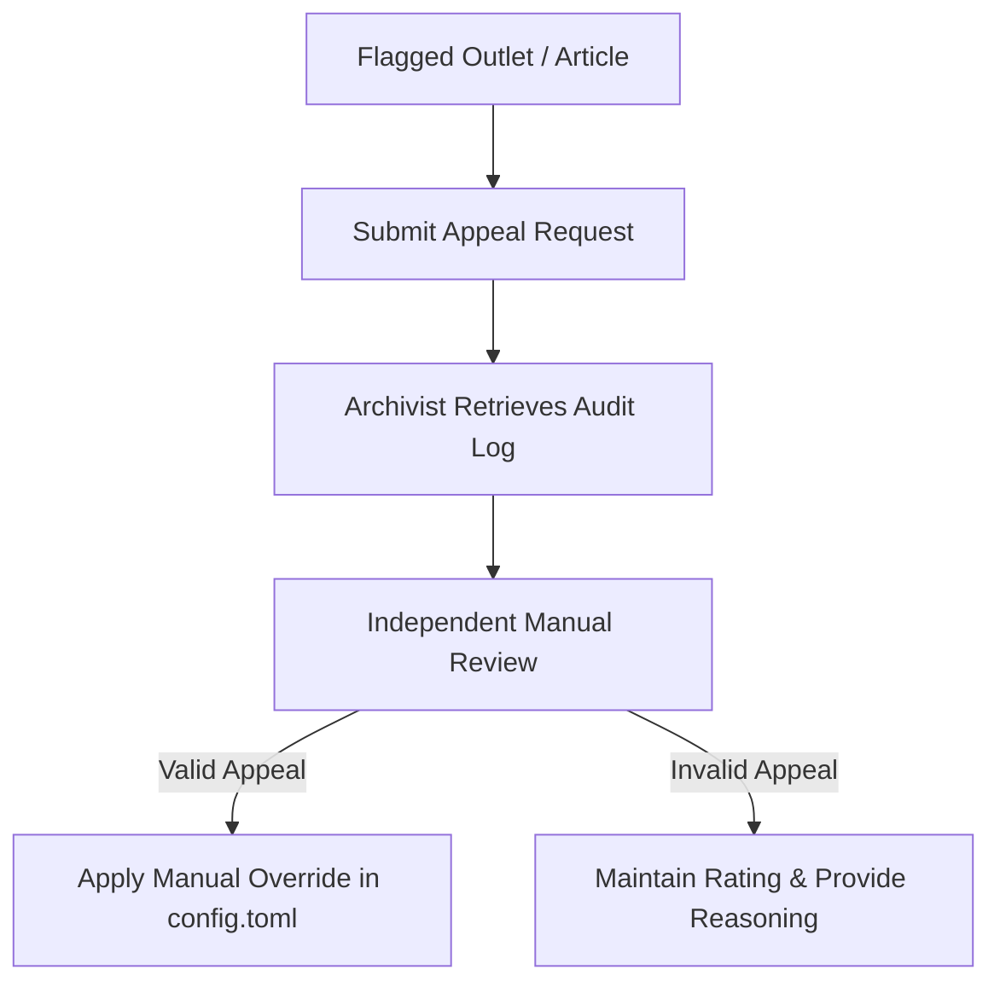

# Ethical Framework & Legal Compliance Guidelines

Mediálny Dezolator is designed to detect and flag disinformation campaigns in the Slovak and Central European media landscape. Given the high stakes of labeling content as "disinformation" or "inauthentic," this document outlines our ethical boundaries, legal compliance strategies (specifically regarding Slovak defamation law), false positive mitigation, and appeal processes.

---

## 1. Ethical Boundaries

Our multi-agent system operates under strict ethical guidelines to preserve democratic discourse and avoid weaponization:

* **Respect for Free Speech:** The system must distinguish between malicious, coordinated disinformation and legitimate expression of opinion, dissent, political commentary, or satire. 
* **Political Neutrality:** Agents must evaluate claims based on empirical factuality, source reliability, and coordination metrics, without political or ideological bias.
* **Algorithmic Transparency:** All system classifications must output the provenance chain, confidence scores, and decomposed uncertainty metrics (`u_ale` and `u_epi`) to ensure that automated decisions are fully auditable by human operators.

---

## 2. Legal Context: Slovak Defamation Law

In Slovakia, labeling an individual, journalist, or media outlet as a "disinformation source" carries significant legal risks:

* **Slovak Criminal Code (§ 373 Trestného zákona - Pomluva):** Defamation is a criminal offense in Slovakia, defined as communicating false information about another person that is likely to damage their reputation, disrupt their employment, or harm their family relationships.
* **Civil Protection of Personality Rights (Občiansky zákonník):** Outlets and individuals can sue for damages if their reputation is harmed by unsubstantiated labeling.
* **Mitigation Strategy:**
  1. **Confidence Gating & HITL Tiers:** Any claim with high aleatoric uncertainty (`u_ale`) or moderate/borderline disinformation probability ($P_{\text{fake}} \in [0.45, 0.75]$) is strictly prohibited from auto-publishing and must be routed to the human-in-the-loop (HITL) queue.
  2. **Audit Trails:** All automatic and manual verdicts must be logged in `output/weight_history.jsonl` along with the specific evidence gathered (e.g., SBERT semantic similarity scores, MBFC/NewsGuard records, Wikidata SPARQL matches).

---

## 3. False Positive Risks & Mitigation

False positives (mislabeling legitimate, albeit biased or sensational, reporting as coordinated disinformation) can erode trust in fact-checking tools. We mitigate this through:

* **Information Laundering Gating:** If a claim has a high `laundering_risk_score` (> 0.60), the source-rater agent is instructed to force the credibility score to neutral (0.50) rather than a negative score, appending the flag `LAUNDERING RISK` for manual investigation.
* **Agreement Verification:** Borders-of-agreement require at least two independent human annotators to review a claim before updating Bayesian weights, ensuring single-annotator biases do not skew the ensemble.
* **Satire & Opinion Classification:** In accordance with our [Annotation Guidelines](annotation_guidelines.md), satire and pure opinion pieces must not be labeled as disinformation unless they are part of a coordinated campaign using fabricated factual assertions.

---

## 4. Appeal & Redress Mechanism

Outlets, journalists, or individuals who believe they have been incorrectly flagged or rate-limited by the system have access to a transparent appeal process:

1. **Submission:** Appeals can be submitted via our API endpoint `/api/v1/appeals` or email, referencing the specific `claim_id` or `source_url`.
2. **Audit Review:** The archivist retrieves the exact state of the ensemble weights, source ratings, and raw agent outputs at the time of the flagging.
3. **Re-Evaluation:** A panel of at least two independent human reviewers evaluates the appeal. If the rating was a false positive, a manual override is added to the local source registry, and the correct label is injected into the training/calibration corpus.
