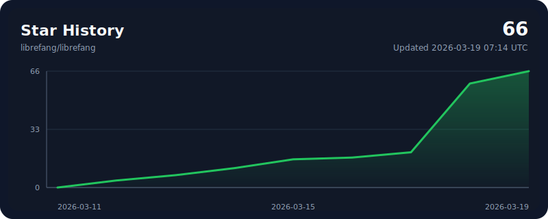

<p align="center">
  
</p>

<h1 align="center">LibreFang</h1>
<h3 align="center">Freies Agenten-Betriebssystem — Libre bedeutet Freiheit</h3>

<p align="center">
  Open-Source Agent OS in Rust. 14 Crates. 2.100+ Tests. Null Clippy-Warnungen.
</p>

<p align="center">
  <a href="../README.md">English</a> | <a href="README.zh.md">中文</a> | <a href="README.ja.md">日本語</a> | <a href="README.ko.md">한국어</a> | <a href="README.es.md">Español</a> | <a href="README.de.md">Deutsch</a>
</p>

<p align="center">
  <a href="https://librefang.ai/">Webseite</a> &bull;
  <a href="https://docs.librefang.ai">Dokumentation</a> &bull;
  <a href="../CONTRIBUTING.md">Mitwirken</a> &bull;
  <a href="https://discord.gg/DzTYqAZZmc">Discord</a>
</p>

<p align="center">
  <a href="https://github.com/librefang/librefang/actions/workflows/ci.yml"></a>
  
  
  
  
  <a href="https://discord.gg/DzTYqAZZmc"></a>
</p>

---

## Was ist LibreFang?

LibreFang ist ein **Agenten-Betriebssystem** — eine vollständige Plattform zur Ausführung autonomer KI-Agenten, von Grund auf in Rust gebaut. Kein Chatbot-Framework, kein Python-Wrapper.

Herkömmliche Agenten-Frameworks warten auf Ihre Eingabe. LibreFang führt **Agenten aus, die für Sie arbeiten** — nach Zeitplan, 24/7, Ziele überwachen, Leads generieren, Social Media verwalten und an Ihr Dashboard berichten.

> LibreFang ist ein Community-Fork von [`RightNow-AI/openfang`](https://github.com/RightNow-AI/openfang) mit offener Governance und Merge-First PR-Policy. Siehe [GOVERNANCE.md](../GOVERNANCE.md) für Details.

## Schnellstart

```bash
# Installieren
cargo install --git https://github.com/librefang/librefang librefang-cli

# Initialisieren (führt durch die Provider-Einrichtung)
librefang init

# Starten — Dashboard unter http://localhost:4545
librefang start
```

<details>
<summary><strong>Homebrew</strong></summary>

```bash
brew tap librefang/tap && brew install librefang
```

</details>

<details>
<summary><strong>Docker</strong></summary>

```bash
docker run -p 4545:4545 ghcr.io/librefang/librefang
```

</details>

<details>
<summary><strong>Cloud-Deployment</strong></summary>

[](https://deploy.librefang.ai) [](https://deploy.librefang.ai) [](https://render.com/deploy?repo=https://github.com/librefang/librefang) [](https://railway.app/template/librefang) [](../infra/gcp/README.md)

</details>

## Hands: Agenten, die für Sie arbeiten

**Hands** sind vorgefertigte autonome Fähigkeitspakete, die unabhängig nach Zeitplan arbeiten. 14 integriert:

| Hand | Funktion |
|------|----------|
| **Researcher** | Tiefenrecherche — Mehrquellen-Kreuzreferenz, CRAAP-Glaubwürdigkeitsbewertung, zitierte Berichte |
| **Collector** | OSINT-Überwachung — Änderungserkennung, Sentimentverfolgung, Wissensgraph |
| **Predictor** | Superprognose — kalibrierte Vorhersagen mit Konfidenzintervallen |
| **Strategist** | Strategieanalyse — Marktforschung, Wettbewerbsintelligenz, Geschäftsplanung |
| **Analytics** | Datenanalyse — Erfassung, Analyse, Visualisierung, automatische Berichte |
| **Trader** | Marktintelligenz — Multi-Signal-Analyse, Risikomanagement, Portfolioanalyse |
| **Lead** | Interessentensuche — Webrecherche, Scoring, Deduplizierung, Lead-Lieferung |
| **Twitter** | Autonomes X/Twitter — Content-Erstellung, Terminplanung, Genehmigungswarteschlange |
| **Reddit** | Reddit-Management — Subreddit-Überwachung, Posting, Engagement-Tracking |
| **LinkedIn** | LinkedIn-Management — Content-Erstellung, Networking, professionelle Interaktion |
| **Clip** | YouTube zu Shorts — Beste Momente schneiden, Untertitel, KI-Sprecherstimme |
| **Browser** | Web-Automatisierung — Playwright-basiert, obligatorisches Kaufgenehmigungsgate |
| **API Tester** | API-Tests — Endpunkt-Erkennung, Validierung, Lasttests, Regressionserkennung |
| **DevOps** | DevOps-Automatisierung — CI/CD, Infrastrukturüberwachung, Incident Response |

```bash
librefang hand activate researcher   # Beginnt sofort zu arbeiten
librefang hand status researcher     # Fortschritt prüfen
librefang hand list                  # Alle Hands anzeigen
```

Eigene Hands erstellen: `HAND.toml` + System-Prompt + `SKILL.md` definieren. [Anleitung](../docs/skill-development.md)

## Architektur

14 Rust-Crates, modulares Kernel-Design.

```
librefang-kernel      Orchestrierung, Workflows, Metering, RBAC, Scheduler, Budget
librefang-runtime     Agenten-Loop, 3 LLM-Treiber, 53 Tools, WASM-Sandbox, MCP, A2A
librefang-api         140+ REST/WS/SSE-Endpunkte, OpenAI-kompatible API, Dashboard
librefang-channels    40 Messaging-Adapter, Rate Limiting, DM/Gruppen-Policies
librefang-memory      SQLite-Persistenz, Vektor-Embeddings, Sessions, Komprimierung
librefang-types       Kerntypen, Taint-Tracking, Ed25519-Signierung, Modellkatalog
librefang-skills      60 gebündelte Skills, SKILL.md-Parser, FangHub-Marktplatz
librefang-hands       14 autonome Hands, HAND.toml-Parser, Lifecycle-Management
librefang-extensions  25 MCP-Templates, AES-256-GCM-Vault, OAuth2 PKCE
librefang-wire        OFP P2P-Protokoll, HMAC-SHA256 gegenseitige Authentifizierung
librefang-cli         CLI, Daemon-Management, TUI-Dashboard, MCP-Servermodus
librefang-desktop     Tauri 2.0 native App (Tray, Benachrichtigungen, Shortcuts)
librefang-migrate     OpenClaw, LangChain, AutoGPT Migrationsengine
xtask                 Build-Automatisierung
```

## Hauptfunktionen

**40 Kanaladapter** — Telegram, Discord, Slack, WhatsApp, Signal, Matrix, E-Mail, Teams, Google Chat, Feishu, LINE, Mastodon, Bluesky und 26 weitere. [Vollständige Liste](../docs/channel-adapters.md)

**27 LLM-Anbieter** — Anthropic, Gemini, OpenAI, Groq, DeepSeek, OpenRouter, Ollama und 20 weitere. Intelligentes Routing, automatisches Fallback, Kostenverfolgung. [Details](../docs/providers.md)

**16 Sicherheitsschichten** — WASM-Sandbox, Merkle-Auditpfad, Taint-Tracking, Ed25519-Signierung, SSRF-Schutz, Secret-Zeroization und mehr. [Details](../docs/comparison.md#16-security-systems--defense-in-depth)

**OpenAI-kompatible API** — Drop-in `/v1/chat/completions`-Endpunkt. 140+ REST/WS/SSE-Endpunkte. [API-Referenz](../docs/api-reference.md)

**Client-SDKs** — [JavaScript](../sdk/javascript) &bull; [Python](../sdk/python) &bull; [Rust](../sdk/rust) &bull; [Go](../sdk/go) — vollständiger REST-Client mit Streaming-Unterstützung.

**OpenClaw-Migration** — `librefang migrate --from openclaw` importiert Agenten, Verlauf, Skills und Konfiguration.

## Entwicklung

```bash
cargo build --workspace --lib                            # Build
cargo test --workspace                                   # 2.100+ Tests
cargo clippy --workspace --all-targets -- -D warnings    # Null Warnungen
cargo fmt --all -- --check                               # Formatprüfung
```

## Vergleich

Siehe [docs/comparison.md](../docs/comparison.md) für Benchmarks und Feature-Vergleich vs OpenClaw, ZeroClaw, CrewAI, AutoGen und LangGraph.

## Links

- [Dokumentation](https://docs.librefang.ai) &bull; [API-Referenz](../docs/api-reference.md) &bull; [Erste Schritte](../docs/getting-started.md)
- [Mitwirken](../CONTRIBUTING.md) &bull; [Governance](../GOVERNANCE.md) &bull; [Sicherheit](../SECURITY.md)
- Diskussionen: [Q&A](https://github.com/librefang/librefang/discussions/categories/q-a) &bull; [Anwendungsfälle](https://github.com/librefang/librefang/discussions/categories/show-and-tell) &bull; [Feature-Abstimmungen](https://github.com/librefang/librefang/discussions/categories/ideas) &bull; [Ankündigungen](https://github.com/librefang/librefang/discussions/categories/announcements) &bull; [Discord](https://discord.gg/DzTYqAZZmc)

## Mitwirkende

<a href="https://github.com/librefang/librefang/graphs/contributors">
  
</a>

<p align="center">
  <a href="https://github.com/librefang/librefang/stargazers">
    
  </a>
</p>

---

<p align="center">MIT-Lizenz</p>
